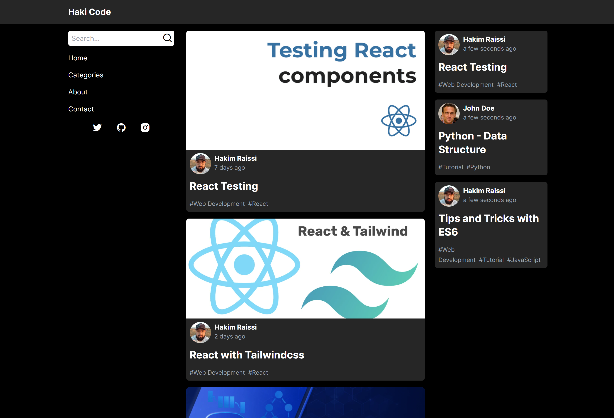

# NEXTJS - Blog

## About the project

### Description

This is a very basic blog application that I built to learn nextJS and GraphCMS. For those who haven't noticed, it is inspired by [DEV](https://dev.to/)

Thanks to [Adrian Hajdin](https://github.com/adrianhajdin) from [JavaScript Mastery](https://www.youtube.com/c/JavaScriptMastery) for his amazing free courses, it helped me a lot to wrap my head around graphCMS and Nextjs

### Built with

- [React](https://reactjs.org/)
- [NextJS](https://nextjs.org/)
- [TailwindCSS](https://tailwindcss.com/)
- [GraphQL](https://graphql.org/)
- [GraphCMS](https://graphcms.com/)

### Screenshots

#### Mobile

   |              Landing Screen               |                Menu Screen                |
   | :---------------------------------------: | :---------------------------------------: |
   |  |  |

#### Desktop



## Getting Started

### Install Dependencies

open your terminal in the root directory and type the following commands in order :

```
npm install

cd client

npm install
```

### Create a .env file

```
NEXT_PUBLIC_GRAPHCMS_ENDPOINT={ your graphCMS public endpoint }
```

## Usage

### Start dev server

```
npm run dev

# or

yarn dev
```


### Build

```
npm run build 

# or

yarn build
```


## License

Distributed under the MIT License.

## Contacts

Hakim Raissi - [@Hakim_Raissi_10](https://twitter.com/Hakim_Raissi_10) - raissihakim1808@outlook.fr

Project Link: [https://github.com/HakimRaissi/next-blog](https://github.com/HakimRaissi/next-blog)